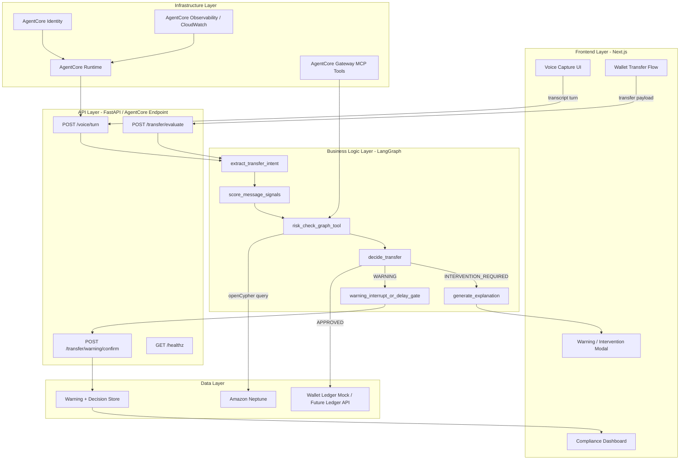
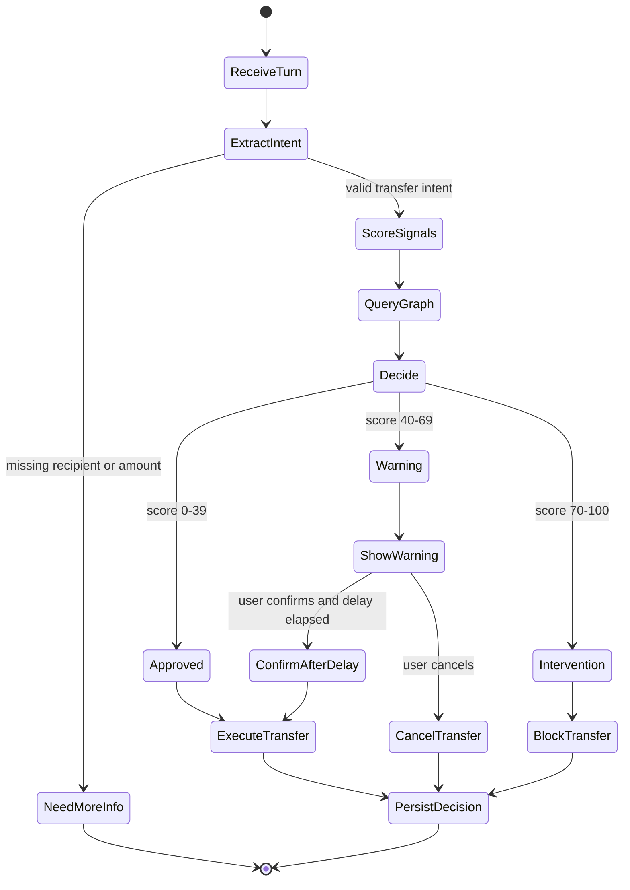
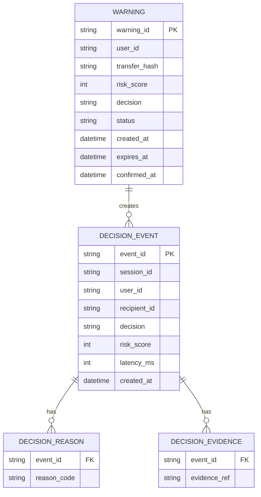

# Voice Agent Feature Implementation Plan

## Goal

Build the TNG Guardian Voice agent as a voice-input transfer assistant that helps users complete wallet tasks while preventing scam transfers. The first production-shaped version accepts speech-to-text transcript turns, extracts transfer intent, calls a deterministic fraud check backed by Amazon Neptune, and returns either approval, a warning flow, or intervention. The LLM must not make the final money-movement decision; it can only help with language understanding and user-facing explanation. The feature must preserve fast normal transfers, explain every warning with reason codes, and support later deployment on Amazon Bedrock AgentCore Runtime.

## Current State

- `frontend/` is a Next.js wallet and compliance dashboard demo with simulated safe/scam transfer buttons.
- `backend/` is a FastAPI service with a minimal LangGraph risk flow, Neptune Data API access, `/risk/check`, `/transfer/evaluate`, and `/transfer/warning/confirm`.
- Neptune connectivity is configured through `NEPTUNE_ENDPOINT`, `AWS_REGION`, and `AWS_PROFILE` in `backend/.env`.
- Existing backend warning state is in-memory and must be replaced before real multi-session usage.

## Requirements

- Accept STT transcript text from the client; TTS is out of scope for v1.
- Support transfer intent capture for `user_id`, `recipient_id`, `amount`, `message`, and optional metadata hashes.
- Run a deterministic synchronous fraud gate before any transfer execution.
- Use graph intelligence from Neptune for recipient relationship risk.
- Use deterministic signal extraction for message risk, including FinBERT-style financial sentiment and emotion pressure signals.
- Return one of `APPROVED`, `WARNING`, or `INTERVENTION_REQUIRED`.
- For `WARNING`, show reason codes and require explicit user confirmation after a 30-second cooling-off delay.
- For `INTERVENTION_REQUIRED`, block the transfer and produce an explainable intervention payload.
- Persist decision events, warnings, and confirmation outcomes for dashboard and audit views.
- Deploy the agent orchestration path on AgentCore Runtime after local FastAPI validation.
- Use AgentCore Identity for runtime authentication and outbound AWS/service credentials.
- Use AgentCore Observability or CloudWatch-compatible traces for node and tool latency.
- Keep p95 synchronous risk check under 100 ms when Neptune is reachable from AWS network placement; local development may be slower.

## System Architecture



## Technology Choices

- **LangGraph:** Use for explicit state, node ordering, branching, and human-in-the-loop warning flow. This fits the need for a controlled fraud gate.
- **FastAPI:** Keep as the local backend and API adapter because it already exists and is easy to test.
- **Amazon Neptune:** Source of graph relationship features, queried through signed Neptune Data API / openCypher.
- **AgentCore Runtime:** Target deployment host once the local backend flow is stable.
- **AgentCore Identity:** Runtime authentication and outbound credential management.
- **AgentCore Gateway:** Optional v1.1 layer to expose `risk_check` and future ledger/eKYC tools as MCP-compatible tools.
- **AgentCore Memory:** Use only for session/checkpoint persistence, not as the source of truth for fraud or ledger data.
- **CloudWatch / AgentCore Observability:** Required for node latency, tool latency, warning rates, and error rates.

## LangGraph Workflow



## Backend Implementation Plan

1. Split `backend/main.py` into focused modules without changing behavior:
   - `app.py` or `main.py`: FastAPI app wiring.
   - `models.py`: Pydantic request/response models.
   - `risk_engine.py`: deterministic scoring and thresholds.
   - `neptune_client.py`: signed Neptune queries and timeout policy.
   - `voice_graph.py`: LangGraph state graph.
   - `stores.py`: warning and decision persistence.

2. Add the voice-turn API:
   - `POST /voice/turn`
   - Input: `session_id`, `user_id`, `transcript`, `language`, optional `partial`.
   - Output: `agent_message`, `intent_state`, optional `transfer_preview`, optional `risk_decision`.
   - Behavior: partial transcript updates session state only; final transcript can trigger transfer evaluation if all required fields are present.

3. Replace in-memory warning state:
   - Hackathon-safe option: SQLite table in `backend/data/guardian.db`.
   - AWS deployment option: DynamoDB table keyed by `warning_id`.
   - Store `warning_id`, `user_id`, `transfer_hash`, `risk_score`, `reason_codes`, `created_at`, `expires_at`, `confirmed_at`, and `status`.

4. Persist decision events:
   - Store every `APPROVED`, `WARNING`, `INTERVENTION_REQUIRED`, `CANCELLED`, and `APPROVED_AFTER_WARNING` event.
   - Include `latency_ms`, `reason_codes`, `evidence_refs`, and hashed metadata only.

5. Expand graph risk queries:
   - Current: prior interaction count.
   - Add recipient novelty, shared device/IP hash, recent inbound velocity, known suspicious neighbor count, and 1-hop/2-hop risk flags.
   - Keep query count small; synchronous path should use one bounded query.

6. Add deterministic message signal extraction:
   - Use simple rules first for demo stability.
   - Add FinBERT/emotion model adapter behind a service interface later.
   - Return normalized signal fields: `finbert_risk`, `emotion_pressure`, `phishing_pattern`, `neutrality`.

7. Implement real HITL with LangGraph interrupt after persistence is added:
   - Use `interrupt()` for warning approval.
   - Resume with `Command(resume=...)`.
   - Use `thread_id=session_id` so warning state can resume correctly.
   - Keep the current REST confirmation endpoint as the frontend adapter.

8. Add tests:
   - Unit tests for scoring thresholds and reason codes.
   - Unit tests for warning delay behavior.
   - Mocked Neptune tests for graph risk cases.
   - API tests for `/voice/turn`, `/transfer/evaluate`, and `/transfer/warning/confirm`.

## Frontend Implementation Plan

1. Add a voice transfer panel to `WalletView`:
   - Microphone button.
   - Transcript preview.
   - Detected recipient/amount/message preview.
   - Processing state while risk check runs.

2. Add STT adapter:
   - Browser Web Speech API for fastest hackathon path.
   - Later replace with streaming STT provider if production-quality multilingual support is needed.
   - Send final transcript to `POST /voice/turn`.

3. Replace simulated safe/scam buttons with API-backed paths:
   - Safe demo calls `/transfer/evaluate` and commits only on `APPROVED`.
   - Scam demo calls `/transfer/evaluate` and shows modal from real response payload.

4. Update `ScamInterventionModal`:
   - Render backend `reason_codes`, `risk_score`, and `evidence_refs`.
   - Disable continue action until `/transfer/warning/confirm` returns `APPROVED_AFTER_WARNING`.
   - For `INTERVENTION_REQUIRED`, hide continue action and show cancel/report action only.

5. Update dashboard:
   - Read decision events from backend.
   - Show protected amount from cancelled/blocked warning events.
   - Show graph evidence from persisted `evidence_refs`.

## API Design

### `POST /voice/turn`

Request:

```ts
type VoiceTurnRequest = {
  session_id: string
  user_id: string
  transcript: string
  language?: "ms" | "en" | "zh" | "ta" | "manglish"
  partial?: boolean
}
```

Response:

```ts
type VoiceTurnResponse = {
  session_id: string
  agent_message: string
  intent_state: "NEED_MORE_INFO" | "READY_TO_EVALUATE" | "EVALUATED"
  transfer_preview?: {
    recipient_id?: string
    amount?: number
    message?: string
  }
  risk_decision?: TransferEvaluateResponse
}
```

### `POST /transfer/evaluate`

Keep the current shape and add optional `session_id`:

```ts
type TransferEvaluateRequest = {
  session_id?: string
  user_id: string
  recipient_id: string
  amount: number
  message: string
  recipient_is_new: boolean
  device_id?: string
  ip_hash?: string
  transaction_context_hash?: string
}
```

### `POST /transfer/warning/confirm`

Keep the current shape:

```ts
type WarningConfirmRequest = {
  warning_id: string
  confirmed: boolean
}
```

## Data Model



## Neptune Graph Shape

Use one `:User` node per real person and one `:TRANSFERRED_TO` edge per transaction. This keeps the real-time risk query simple and preserves transaction-level evidence for dashboard and audit flows.

### User node

Label: `:User`

Properties:

| Property | Type | Required | Notes |
|---|---:|---:|---|
| `~id` | string | yes | Stable graph id, recommended `user:{user_id}`. |
| `ekyc_status` | string | yes | Example: `pending`, `verified`, `failed`. |
| `ekyc_level` | string | yes | Example: `basic`, `enhanced`. |
| `hashed_phone` | string | yes | Store hash only. |
| `hashed_ic` | string | yes | Store hash only. |
| `risk_tier_current` | string | yes | Example: `low`, `medium`, `high`. |
| `summary_text_latest` | string | no | Latest AI-generated user risk/profile summary. |
| `summary_updated_at` | datetime/string | no | ISO-8601 timestamp. |
| `summary_agent_version` | string | no | Keep for summary traceability. |
| `created_at` | datetime/string | yes | ISO-8601 timestamp. |
| `updated_at` | datetime/string | yes | ISO-8601 timestamp. |

### Transaction edge

Relationship: `(:User)-[:TRANSFERRED_TO]->(:User)`

One edge represents one transaction. Do not collapse repeated transfers into a single edge because the dashboard and audit flow need per-transaction evidence.

Properties:

| Property | Type | Required | Notes |
|---|---:|---:|---|
| `~id` | string | yes | Stable edge id, recommended `tx:{tx_id}`. |
| `tx_time` | datetime/string | yes | ISO-8601 timestamp. |
| `amount` | number | yes | Transaction amount. |
| `currency` | string | yes | Example: `MYR`. |
| `message_text` | string | yes | User-entered transfer message. If privacy mode is enabled, replace with hash and store display copy outside Neptune. |
| `tx_note` | string | no | Optional transaction note entered by user. |
| `channel` | string | yes | Example: `voice`, `app`, `qr`. |
| `status` | string | yes | One of `approved`, `warned`, `blocked`, `reversed`. |
| `finbert_score` | number | yes | Latest score for this transaction edge. |
| `emotion_score` | number | yes | Latest score for this transaction edge. |
| `risk_score_latest` | number | yes | Latest combined risk score. |
| `risk_reason_codes` | string/list | yes | Store as JSON string if Neptune property list support is inconvenient from client code. |
| `updated_at` | datetime/string | yes | ISO-8601 timestamp. |

### Query implications

- Real-time recipient novelty: count recent `TRANSFERRED_TO` edges from sender to recipient.
- Recipient risk: inspect recipient `risk_tier_current` and recent inbound `TRANSFERRED_TO` edges.
- Scam pattern evidence: filter recent edges with high `finbert_score`, high `emotion_score`, or risky `risk_reason_codes`.
- Dashboard evidence: render the exact transaction edge that produced a warning or block.
- Data retention: keep transaction edges for 12 months, then delete or archive them.

## Deployment Plan

1. Local first:
   - Run FastAPI with `uv run uvicorn main:app --reload`.
   - Run frontend with `pnpm dev`.
   - Use `.env.local` for `NEXT_PUBLIC_API_BASE_URL`.

2. AWS network placement:
   - Deploy backend/agent inside the same VPC path as Neptune to avoid local public endpoint latency.
   - Use IAM DB authentication for Neptune.
   - Keep Neptune security group inbound restricted to the backend runtime security group.

3. AgentCore Runtime:
   - Package the LangGraph app as an AgentCore runtime project.
   - Use AgentCore CLI for local runtime test, deployment, invocation, logs, and traces.
   - Configure AgentCore Identity for inbound auth and AWS credentials.

4. AgentCore Gateway:
   - Expose `risk_check` as a tool target only after the direct API path is stable.
   - Later add eKYC, ledger, and compliance-summary tools.

5. Observability:
   - Emit spans for `voice_turn`, `extract_intent`, `score_signals`, `neptune_query`, `decision`, and `warning_confirm`.
   - Track p50/p95/p99 latency and decision distribution.

## Security and Reliability

- Default to fail-safe warning when Neptune or model-dependent signal extraction is unavailable.
- Never let an LLM execute or approve money movement directly.
- Validate all API inputs with Pydantic.
- Hash sensitive metadata before storing it in logs, Neptune, or decision stores.
- Add rate limits by `user_id` and `session_id` before public demo exposure.
- Ensure warning confirmations are bound to the same `user_id` and transfer hash.
- Expire warning IDs after a short TTL, recommended 10 minutes.
- Keep raw transcript retention disabled by default; store only extracted intent and hashed evidence unless explicitly needed for demo.

## Testing Plan

- `test_risk_engine_approved_low_score`: low amount, known recipient, neutral message returns `APPROVED`.
- `test_risk_engine_warning_mid_score`: new recipient plus medium amount returns `WARNING`.
- `test_risk_engine_intervention_high_score`: high-risk message and high amount returns `INTERVENTION_REQUIRED`.
- `test_graph_unavailable_fails_safe`: Neptune exception adds fail-safe reason and does not crash.
- `test_warning_confirm_pending_delay`: immediate confirmation returns `PENDING_DELAY`.
- `test_warning_confirm_after_delay`: delayed confirmation returns `APPROVED_AFTER_WARNING`.
- `test_voice_turn_needs_more_info`: transcript missing amount asks for amount.
- `test_voice_turn_evaluates_complete_intent`: transcript with recipient and amount triggers risk evaluation.
- Frontend smoke test: safe transfer, warning transfer, blocked transfer, dashboard update.

## Milestones

### Milestone 1: Backend Hardening

- Modularize backend files.
- Add persistent warning and decision stores.
- Add backend tests.
- Acceptance: existing endpoints pass tests and no longer depend on process memory.

### Milestone 2: Voice Turn API

- Add `/voice/turn`.
- Add deterministic intent extraction for transfer commands.
- Add tests for missing information and complete transfer intent.
- Acceptance: transcript input can drive transfer evaluation without frontend simulation buttons.

### Milestone 3: Frontend Integration

- Add microphone/transcript UI.
- Wire wallet flow to backend decisions.
- Render real warning/intervention payloads.
- Acceptance: frontend demo uses backend decision responses end to end.

### Milestone 4: AgentCore Deployment

- Package LangGraph runtime for AgentCore.
- Configure Identity and Observability.
- Add deployment README.
- Acceptance: deployed AgentCore endpoint can invoke the same transfer evaluation flow.

### Milestone 5: Graph Risk Expansion

- Add bounded Neptune query for shared IP/device/account and suspicious neighbor count.
- Add seeded demo graph data.
- Acceptance: dashboard graph and reason codes reflect actual Neptune evidence.

## Success Criteria

- Normal transfer path completes under 2 seconds end to end.
- Synchronous risk component targets p95 under 100 ms when deployed near Neptune.
- Every warning and intervention includes reason codes.
- User can cancel a warned transfer and dashboard protected amount updates.
- User cannot proceed on `INTERVENTION_REQUIRED`.
- Warning confirmation cannot approve before the configured delay.
- Backend tests cover scoring, graph fallback, HITL, and voice-turn intent flow.

## References

- `prd.md`
- `backend/main.py`
- AWS AgentCore overview: https://docs.aws.amazon.com/bedrock-agentcore/latest/devguide/what-is-bedrock-agentcore.html
- AWS AgentCore Runtime quickstart: https://docs.aws.amazon.com/bedrock-agentcore/latest/devguide/agentcore-get-started-cli.html
- AWS AgentCore Memory with LangGraph: https://docs.aws.amazon.com/bedrock-agentcore/latest/devguide/memory-integrate-lang.html
- LangGraph interrupts: https://docs.langchain.com/oss/python/langgraph/interrupts
- LangGraph graph API: https://docs.langchain.com/oss/python/langgraph/graph-api
